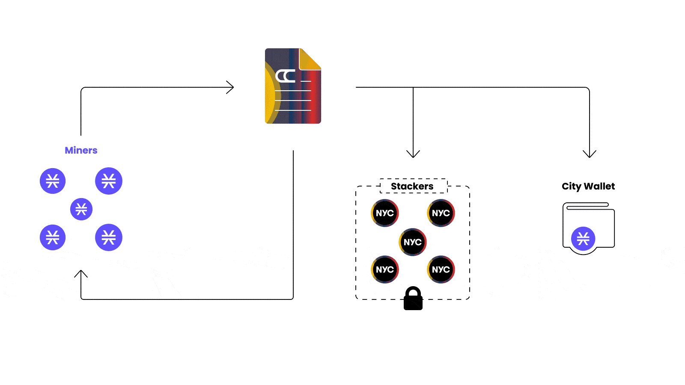

# Mining CityCoins


CityCoins require the [Stacks Web Wallet](https://hiro.so/wallet/install-web) to interact with the smart contracts on the [Stacks blockchain](https://stacks.co). (see [How do I get started?](../about-citycoins/how-do-i-get-started.md))


## Overview

Anyone can mine CityCoins by submitting a transaction to a CityCoins smart contract on the Stacks blockchain.

There are no hardware requirements and the protocol is open source, so anyone can build a website that interacts with it. The main website for mining/stacking CityCoins is [minecitycoins.com](https://minecitycoins.com), and others are listed under the CityCoins Resources category on the left menu.


Miners can only participate once per block. **Once STX are sent for mining a CityCoin they are not returned,** they are distributed to the city's wallet and CityCoin Stackers.


There are also [code examples](../developer-resources/code-examples/mining.md), [Node.js scripts](https://github.com/citycoins/scripts), and [community resources](../citycoins-resources/general.md#community-tools) built around mining.

For a more technical explanation, please see the contract functions for [mining](../contract-functions/mining.md) and [mining claims](../contract-functions/mining-claims.md).

## How it Works

CityCoin miners spend STX while competing to earn the CityCoin block reward, which is defined by the [token issuance schedule](token-configuration.md#issuance-schedule) and begins at 250,000 CityCoins per block.

* 30% of the STX that miners spend is sent directly to a reserved wallet for the city
* 70% of the STX that miners spend are distributed to people who stack their CityCoins (Stackers)


There is only one winning miner per block that can claim the CityCoin reward.




The city can claim this reserved wallet and convert their STX to USD whenever they want. They can also Stack the STX to earn BTC.

## How to Mine

The main website for mining/stacking CityCoins is [minecitycoins.com](https://minecitycoins.com), and others are listed under the CityCoins Resources category on the left menu.

The general flow for mining on any CityCoins website will be:

1. Log in with your Stacks Wallet
2. Select the number of blocks to mine for (1-200)
3. Select the amount of STX to commit per block
4. Submit the transaction
5. Verify the transaction with the Stacks Wallet


**Remember:** nobody will ask you for your secret key and you should never enter it into a website.


## **Mining Strategy**

You can only submit a mining bid once per block. Once that transaction confirms then the bid is locked in. If you submit a mining transaction in a block where you are already mining, it will fail.

You can also mine for multiple blocks in one transaction by selecting the amount to spend per block and submitting the total bid up front. Once that transaction confirms then the bid is locked in for the following blocks.


You can mine for up to 200 blocks based on the function in the contract, however due to transaction costs, mining over 100 blocks may require a higher fee for the transaction to be processed.


The probability to win at least one block in a sequence of blocks with a fixed commit of `C` STX and a total of other miners `T` STX is the following:

```
P(win at least 1 block in N blocks) = 1 - (T / (T + C)) ^ N
```

An example with real numbers: the table below assumes the total committed by miners in a block is 500 STX, and as a miner you have 200 STX to spend.

|           |                      |                 |
| --------- | -------------------- | --------------- |
| **Spend** | **Number of Blocks** | **Probability** |
| 1 STX     | 200                  | 32.9%           |
| 10 STX    | 20                   | 32.7%           |
| 12.5 STX  | 16                   | 32.6%           |
| 100 STX   | 2                    | 30.5%           |
| 200 STX   | 1                    | 28.5%           |

## **Mining Pools**

Individual miners can pool their funds together and mine CityCoins as a team.&#x20;

There are two main options for mining pools:

* **custodial:** an administrator for the pool will manage funds, make contract calls, and make payouts to pool members
* **non-custodial:** powered by smart contracts, miners can participate simply by sending a transaction and the funds, mining, and payouts are managed by the contract

The [Syvita Guild](https://twitter.com/syvitamining) started the first custodial mining pool for MiamiCoin, and has since deployed a non-custodial version at [syvitamining.com](https://syvitamining.com) targeting all current and future CityCoins.


Always _do your own research_ (DYOR) before participating in a pool by joining the community, evaluating the code, and fully understanding the process.


## **Claiming Rewards**

A winner cannot be verified until 100 Stacks blocks pass from the block mined (\~16 hours).

Mining claims are based on the block height of the transaction, which can be seen by searching for your address in the [Stacks Explorer](https://explorer.stacks.co) and viewing previous mining transactions.


If mining for a single block, then the block height of the transaction is the one to check.

If mining for multiple blocks, then the block height of the transaction is the first block to check, followed by the number of blocks selected.


For example, if mining for 100 blocks and the transaction confirms at block #45,600, then blocks #45,600 to #45,699 should be checked for rewards.


There are [community tools](../citycoins-resources/general.md#community-tools) to help see the mining history including won and/or unclaimed blocks, two examples are below for MIA/NYC where `ADDRESS` is your Stacks address.

* `https://miamining.com/history/ADDRESS`
* `https://mining.nyc/history/ADDRESS`


The general flow for claiming a mining reward on any CityCoins website will be:

1. Log in with your Stacks Wallet
2. Enter the block height to claim the reward
3. Submit the transaction
4. Verify the transaction with the Stacks Wallet


**Remember:** nobody will ask you for your secret key and you should never enter it into a website.

