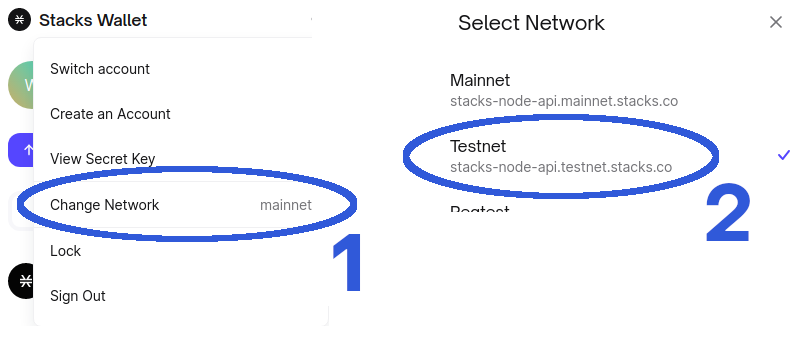

# Testnet FAQ

This FAQ is specifically about our testnet launch, for more information about CityCoins in general please see the [CityCoins FAQ](https://citycoins.co/citycoins-faq) or select an item from the menu on the left.

## Is CityCoins testnet open for everyone?

Yes! We encourage everyone to test out the interface and provide feedback either through the [CityCoins Discord](https://chat.citycoins.co) or [GitHub Issues](https://github.com/citycoins/citycoin-ui/issues/new/choose).

## How can I participate in the CityCoins testnet?

The first step is installing the [Stacks Web Wallet](https://hiro.so/wallet/install-web) \(supports Chrome / Firefox\) and setting the network to **Testnet**.

From there, connect the wallet to the [mining and stacking interface](https://testnet.minemiamicoin.com) to interact with the various functions.

## What can I do on the CityCoins testnet?

Based on the CityCoins Protocol section on the left, you can:

* _Mine_ - by sending testnet STX tokens into the contract
* _Claim Mining Rewards_ - by sending a transaction that claims CityCoins if you are the winner of that block
* _Stack_ - by sending testnet CityCoins into the contract for a selected number of reward cycles
* _Claim Stacking Rewards_ - by sending a transaction that claims your Stacked CityCoins and any resulting STX from testnet miners

## What is different on testnet versus mainnet?

In order to provide a smoother testing experience, some thresholds were reduced on testnet and are outlined below:

* reduce token-reward-maturity: u100 to u10 \(~1.6hrs\)
* reduce reward-cycle-length: u500 to u50 \(~8hrs\)
* reduce activation threshold to u3 registrants
* reduce mining activation delay to u3 blocks

## Where can I get testnet STX?

You can request [Testnet STX tokens](https://explorer.stacks.co/sandbox/faucet?chain=testnet) from the faucet or drop a message with your testnet STX address in [our Discord](https://chat.citycoins.co).

## What is the minimum amount of STX for mining?

Miners can send as little or as much STX into the contract as they'd like, and their contribution will be weighted against the total amount of STX sent by other miners for the VRF selection.

